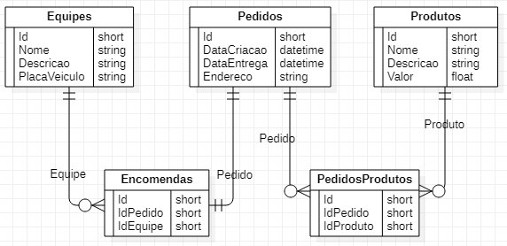

# Resumo
API criada em .NET Core para alimentar uma aplicação frontend onde será mostrado o dashboard com informações sobre o pedido.

Esta API utiliza EntityFramwork para fazer a conexão com o banco SQLite `o banco SQLite foi escolhido para facilitar a visualização de quem baixar o projeto, não precisando configurar nenhum banco de dados`.

Para rodar basta compilar o projeto e clicar em start. Testes podem ser feitos utilizando o Swagger

A API tem o foco somente de listar os pedidos feitos, mas adicionei CRUDs para cada entidade para que seja possível adicionar dados para teste

A cada nova encomenda é criado um pedido, cada pedido tem o seu ID, Data de criação, Data da entrega e endereço. Cada pedido pode conter vários produtos e cada produto possui nome, descrição e valor. Cada encomenda é destinada a uma equipe e cada equipe possui nome, descrição e placa do veículo utilizado.

[O frontend pode ser encontrado aqui](https://github.com/rafael399/DashboardFrontEnd)
## Banco de Dados
Abaixo segue print demonstrando as tabelas criadas e seus relacionamentos

# Endpoint de listagem
O endpoint principal (para listagem dos pedidos) é o `GET:/api/pedido` passando como parametro a pagina e quantidadePorPagina(default de 20) 

# Autorização
Todos os endpoints devem ser chamados com o `Authorization` no header com o token `Bearer f90453ec712ce4505cc425e7e881e1d58ea274c3` como valor